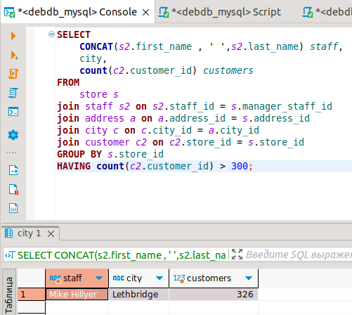
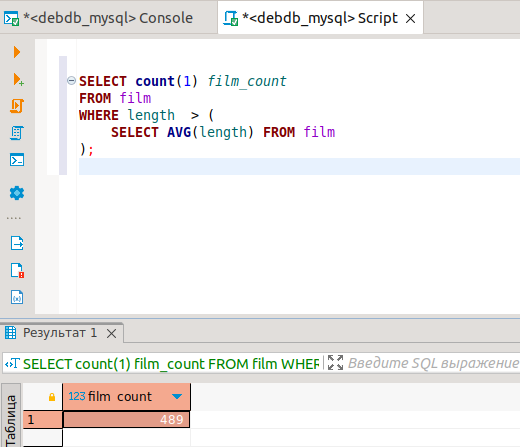
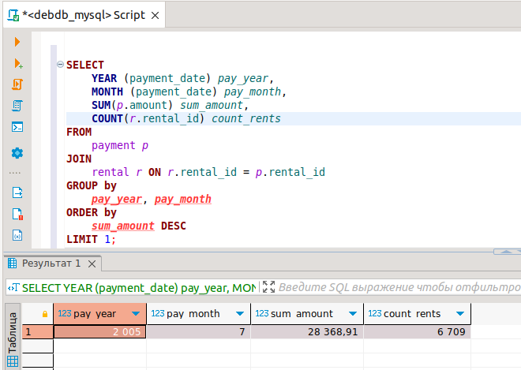

# Домашнее задание к занятию "`SQL. Часть 2`" - `Аблогин Павел`
   
---

### Задание 1

```
sql-запрос для задания 1

SELECT 
	CONCAT(s2.first_name , ' ',s2.last_name) staff, 
	city, 
	count(c2.customer_id) customers 
FROM 
	store s
join staff s2 on s2.staff_id = s.manager_staff_id 
join address a on a.address_id = s.address_id 
join city c on c.city_id = a.city_id 
join customer c2 on c2.store_id = s.store_id 
GROUP BY s.store_id 
HAVING count(c2.customer_id) > 300;

```

`Скриншот выполнения задания 1`


---

### Задание 2

```
sql-запрос для задания 2

SELECT count(1) film_count 
FROM film
WHERE length  > (
	SELECT AVG(length) FROM film
);

```

`Скриншот выполнения задания 2`



---

### Задание 3

```
sql-запрос для задания 2

SELECT 
	MONTH (p.payment_date) pay_month, 
	sum(p.amount) sum_amount, 
	count(r.rental_id) rent_count  
from 
	payment p 
join rental r on r.rental_id = p.rental_id 
group by 
	pay_month 
order by 
	sum_amount DESC 
limit 1;

```

`Скриншот выполнения задания 3`


---

